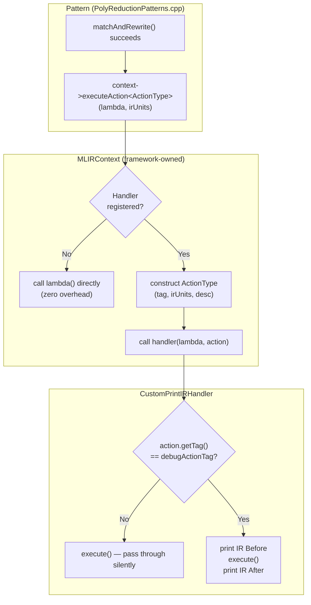
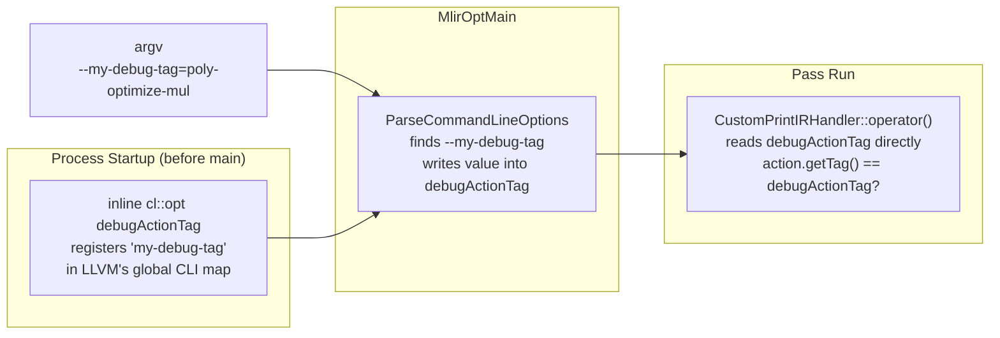

# Action Tracing: Fine-Grained Transform Debugging

This document describes how MLIR Actions are used in this project to intercept
individual pattern rewrites and print IR before/after each one fires — without
modifying the pass pipeline or adding permanent logging.

## Overview

MLIR's [Action framework](https://mlir.llvm.org/docs/ActionTracing/) lets you
wrap any transformation in a typed, tagged object. A registered handler receives
every action and decides what to do: log it, skip it, or just forward it. The
key insight is that **one generic handler + one CLI flag** scales to any number
of distinct actions.

```
tutorial-opt input.mlir --optimize-poly-const --my-debug-tag=poly-optimize-mul
                                                       ▲
                                    pick which action to watch at runtime
```

---

## MLIR Action Framework: How the Pieces Fit Together

### Why Actions Exist

The standard MLIR debugging tools (`-mlir-print-ir-after-all`, `--debug`) have
a scaling problem: they produce a single giant log covering *every* pass and
*every* pattern firing, making it tedious to find the one rewrite you care about.

Actions solve this by letting you **name individual units of transformation** and
then intercept only the named ones you want — at runtime, without recompiling.
The granularity is entirely up to you: an Action can wrap a whole pass pipeline,
a single pattern rewrite, or anything in between.

In this project the granularity is **one Action per rewrite pattern**:
- `PolyOptmizeMul` — fires once each time `MultiplyConstOne` eliminates a `poly.mul`
- `PolyOptmizeAdd` — fires once each time `AddConstZero` eliminates a `poly.add`

This means you can watch *just* the mul rewrites, or *just* the add rewrites,
while the rest of the pass runs silently.

---

### The Three Concepts

The diagram below shows how the three concepts interact every time a pattern
fires:



**Action — "what transformation is this?"**

An Action is a typed object created at the call site of a transformation. It
carries the tag (the name used for filtering) and the IR context (which ops are
being affected). It is stack-allocated and lives only for the duration of the
`executeAction` call — it is not stored or queued anywhere.

```
tracing::ActionImpl<Derived>   (mlir/IR/Action.h)
        ▲                ▲
PolyOptmizeMul    PolyOptmizeAdd     ← your Action types, one per transform
```

**`executeAction` — "dispatch this transformation through the framework"**

This is the only call the *transform author* makes. Instead of calling
`rewriter.replaceOp(op, val)` directly, they wrap it:

```cpp
context->executeAction<PolyOptmizeMul>(
    [&]() { rewriter.replaceOp(op, nonConst); },   // the actual work
    {irUnit}                                         // IR context for handlers
);
```

The framework then either calls the lambda directly (no handler registered) or
routes it through the registered handler first. **The transform author does not
know or care which path is taken.**

**Handler — "what to do when an action fires"**

The handler is registered separately, by the *pass author* (or tool author). It
receives every action dispatched through the context, regardless of type. The
tag comparison is what makes it selective:

```cpp
// handler receives ALL actions — the tag check is the filter
if (action.getTag() != debugActionTag) {
    execute();   // not our target: forward silently
    return;
}
// only reaches here for the one tag we care about
```

The handler has **full control over execution** — it can log, skip, or modify
behaviour around the lambda. This is what makes it useful for bisection
debugging (skip the Nth rewrite to find which one causes a bug).

---

### Where Each Piece Lives in This Codebase

```
WHO defines it       FILE                               WHAT it does
─────────────────────────────────────────────────────────────────────────────
Transform author  PolyReductionPatterns.cpp          wraps replaceOp in
                                                     executeAction<ActionType>

Transform author  PolyOptmizeMulAction.hpp           defines the Action type
                  PolyOptmizeAddAction.hpp            and its tag string

Pass author       PolyConstOptimize.cpp              registers/unregisters
                                                     the handler on MLIRContext

Handler author    CustomPrintIRHandler.hpp/.cpp       implements the handler:
                                                     print before/after IR

Shared infra      DebugActionTag.h                   the --my-debug-tag CLI flag
                                                     shared across all handlers

Build             tools/CMakeLists.txt               compiles handler .cpp into
                                                     the tutorial-opt binary
```

---

### Granularity: What Fires and When

`applyPatternsGreedily` applies patterns repeatedly until the IR stops changing.
Each *successful* pattern application calls `matchAndRewrite` once. Our
`executeAction` is inside `matchAndRewrite`, after the match succeeds — so it
fires **once per successful rewrite**, not once per attempt.

```mermaid
sequenceDiagram
    participant G as applyPatternsGreedily
    participant M1 as MultiplyConstOne
    participant M2 as AddConstZero
    participant C as MLIRContext
    participant H as CustomPrintIRHandler

    G->>M1: matchAndRewrite(poly.mul on func_a)
    M1-->>G: failure() — coefficients not all 1
    Note over C,H: no executeAction called

    G->>M1: matchAndRewrite(poly.mul on func_b)
    M1->>C: executeAction&lt;PolyOptmizeMul&gt;(lambda, {func_b})
    C->>H: handler(lambda, PolyOptmizeMul)
    Note over H: tag matches → Trigger Count: 1
    H->>H: print IR Before
    H->>C: execute() → replaceOp fires
    H->>H: print IR After
    M1-->>G: success()

    G->>M2: matchAndRewrite(poly.add on func_b)
    M2->>C: executeAction&lt;PolyOptmizeAdd&gt;(lambda, {func_b})
    C->>H: handler(lambda, PolyOptmizeAdd)
    Note over H: tag mismatch → pass through silently
    H->>C: execute() → replaceOp fires
    M2-->>G: success()

    G-->>G: no more matches → done
```

Contrast with coarser alternatives:
- Wrapping the whole `applyPatternsGreedily` call = one action for the entire
  pass, no per-pattern visibility
- Wrapping inside the match *before* checking coefficients = fires even on
  failed matches (wasteful and misleading)

The right granularity is **after match, before/wrapping the rewrite** — which
is exactly where `replaceOp` lives.

---

### The IRUnit Choice: What the Handler Can See

The IRUnit array passed to `executeAction` determines what `getContextIRUnits()`
returns inside the handler. In this project we pass the enclosing `func.func`:

```cpp
mlir::Operation *parentFunc = op->getParentOfType<mlir::func::FuncOp>();
mlir::IRUnit irUnit = parentFunc ? parentFunc
                                 : static_cast<mlir::Operation *>(op);
```

This means the handler prints the **entire function** before and after the
rewrite — you see all the ops in context, not just the one being rewritten.

Alternative choices and their tradeoffs:

| IRUnit passed           | Handler sees                  | Good for                        |
|-------------------------|-------------------------------|---------------------------------|
| `op` (the MulOp itself) | Only the rewritten op         | Fine-grained op-level tracing   |
| `parentFunc` (func.func)| The whole function ✓          | Seeing before/after in context  |
| `op->getParentRegion()` | The region containing the op  | Block-level analysis            |
| Multiple units          | e.g. `{op, parentFunc}`       | Both the op and its context     |

---

### How `executeAction` Routes Through the Framework

Internally, `MLIRContext::executeAction` does roughly:

```
executeAction<ActionType>(lambda, irUnits):
    if (no handler registered):
        lambda()        ← direct call, zero overhead
        return
    action = ActionType(irUnits)    ← stack-allocate the Action object
    handlerFn(lambda, action)       ← call the registered handler
```

The handler receives `const tracing::Action &` — a reference to the base class.
This is why `action.getTag()` works generically (virtual dispatch to
`ActionImpl::getTag()` which returns `Derived::tag`), and why `action.print()`
dispatches to our overridden `print()` which includes the `desc` string.

---

### How the CLI Flag Reaches the Handler



The `inline llvm::cl::opt` in `DebugActionTag.h` is the C++17 mechanism that
gives this global a single definition across the whole binary without needing a
separate `.cpp` file. Any handler that `#include`s the header participates in
the same flag automatically.

---

## File Layout

```
lib/Utility/
  DebugActionTag.h             # inline CLI flag shared by all handlers
  PolyOptimizeAddAction.hpp    # Action type for poly.add rewrites
  PolyOptmizeMulAction.hpp     # Action type for poly.mul rewrites
  CustomPrintIRHandler.hpp     # Handler declaration
  CustomPrintIRHandler.cpp     # Handler implementation (compiled into tutorial-opt)

lib/Dialect/Poly/
  PolyReductionPatterns.cpp    # Patterns — wrap replaceOp in executeAction

lib/Transform/Poly/
  PolyConstOptimize.cpp        # Pass — registers/unregisters handler

tools/
  CMakeLists.txt               # Compiles CustomPrintIRHandler.cpp into tutorial-opt
```

---

## Step 1: Shared CLI Flag (`DebugActionTag.h`)

All handlers share a single `--my-debug-tag` flag. The `inline` keyword
(C++17) ensures exactly one instance exists in the binary regardless of how
many files include this header.

```cpp
// lib/Utility/DebugActionTag.h
inline llvm::cl::opt<std::string> debugActionTag(
    "my-debug-tag",
    llvm::cl::desc("The action tag to intercept and log"),
    llvm::cl::init("")
);
```

`MlirOptMain` calls `llvm::cl::ParseCommandLineOptions` internally, which
populates `debugActionTag` from `argv` before any pass runs. Any handler that
`#include`s this header can then read the value directly — no constructor
arguments, no wiring in `main`.

---

## Step 2: Define an Action Type

Each transform that you want to be able to observe independently gets its own
Action class. The minimum requirements are:

- Inherit from `mlir::tracing::ActionImpl<Derived>` (CRTP)
- Provide a unique `static constexpr StringLiteral tag`
- Accept `ArrayRef<IRUnit>` in the constructor (the affected IR context)
- Override `print()` to include a human-readable description

```cpp
// lib/Utility/PolyOptmizeMulAction.hpp
namespace mlir { namespace tracing {

class PolyOptmizeMul : public ActionImpl<PolyOptmizeMul> {
public:
  using Base = ActionImpl<PolyOptmizeMul>;
  PolyOptmizeMul(ArrayRef<IRUnit> irUnits) : Base(irUnits) {}

  static constexpr StringLiteral tag = "poly-optimize-mul";
  static constexpr StringLiteral desc =
      "Fired when MultiplyConstOne eliminates a poly.mul with an all-one constant";

  void print(llvm::raw_ostream &os) const override {
    os << "Action \"" << tag << "\" - " << desc;
  }
};

}} // namespace mlir::tracing
```

The `tag` is what users pass to `--my-debug-tag`. Add a new `.hpp` file per
transform you want to observe independently.

---

## Step 3: Wrap the Transform in `executeAction`

In the pattern's `matchAndRewrite`, instead of calling `rewriter.replaceOp`
directly, wrap it in `context->executeAction<ActionType>(lambda, {irUnits})`.

The `irUnits` are the IR context passed to the handler. Passing the enclosing
`func.func` lets the handler print the whole function before and after.

```cpp
// lib/Dialect/Poly/PolyReductionPatterns.cpp

#include "lib/Utility/PolyOptmizeMulAction.hpp"
#include "mlir/Dialect/Func/IR/FuncOps.h"
#include "mlir/IR/MLIRContext.h"

LogicalResult matchAndRewrite(MulOp op, PatternRewriter &rewriter) const override {
  // ... match logic ...

  // Pass the enclosing func.func as the IRUnit so the handler can print
  // the full function. Fall back to the op itself if there's no parent func.
  mlir::Operation *parentFunc = op->getParentOfType<mlir::func::FuncOp>();
  mlir::IRUnit irUnit = parentFunc ? parentFunc
                                   : static_cast<mlir::Operation *>(op);

  op->getContext()->executeAction<mlir::tracing::PolyOptmizeMul>(
      [&]() { rewriter.replaceOp(op, nonConst); },
      {irUnit});
  return success();
}
```

The lambda is the actual transformation. When no handler is registered the
lambda is called directly with zero overhead.

---

## Step 4: Implement the Handler

The handler is a callable struct with `operator()(execute, action)`. The tag
comparison is the only dispatch logic — no `if/else` chains per action type.

```cpp
// lib/Utility/CustomPrintIRHandler.cpp

void CustomPrintIRHandler::operator()(
    llvm::function_ref<void()> execute, const mlir::tracing::Action &action) {

  // Pass through anything that isn't the requested tag.
  if (debugActionTag.empty() || action.getTag() != debugActionTag) {
    execute();
    return;
  }

  triggerCount++;
  llvm::errs() << "[INTERCEPTED] ";
  action.print(llvm::errs());   // calls the overridden print() on the derived type
  llvm::errs() << "\n              Trigger Count: " << triggerCount << "\n";

  // Print IR from the IRUnits provided at the call site.
  auto printIRUnits = [](llvm::ArrayRef<mlir::IRUnit> irUnits) {
    for (const auto &unit : irUnits)
      if (auto *op = llvm::dyn_cast<mlir::Operation *>(unit))
        op->print(llvm::errs()), llvm::errs() << "\n";
  };

  llvm::errs() << "--- IR Before ---\n";
  printIRUnits(action.getContextIRUnits());
  execute();                              // run the actual transformation
  llvm::errs() << "--- IR After ---\n";
  printIRUnits(action.getContextIRUnits());
}
```

**Scalability:** adding a new action never requires touching the handler.
Just define a new action class with a new tag and the handler will intercept
it automatically when that tag is passed on the CLI.

**Adding a second handler:** create a new class, include `DebugActionTag.h`,
and register it the same way. Both read the same shared flag.

---

## Step 5: Register the Handler in the Pass

Register the handler at the start of `runOnOperation` and clear it at the end
so it doesn't leak into other passes.

```cpp
// lib/Transform/Poly/PolyConstOptimize.cpp

void runOnOperation() {
  CustomPrintIRHandler handler;
  getContext().registerActionHandler(handler);   // arm the handler

  mlir::RewritePatternSet patterns(&getContext());
  poly::populatePolyReductionPatterns(patterns);
  (void)applyPatternsGreedily(getOperation(), std::move(patterns));

  getContext().registerActionHandler(nullptr);   // disarm after pass
}
```

`triggerCount` lives inside `handler` on the stack, so each pass invocation
gets a fresh count starting from 1.

---

## Step 6: Build Wiring (`tools/CMakeLists.txt`)

`CustomPrintIRHandler.cpp` must be compiled directly into `tutorial-opt` (not
into a library) so that the symbol is unconditionally present in the binary.
This is the same pattern used for `DebugHelper.cpp`.

```cmake
add_llvm_executable(tutorial-opt PARTIAL_SOURCES_INTENDED
    tutorial-opt.cpp
    ${PROJECT_SOURCE_DIR}/lib/Utility/DebugHelper.cpp
    ${PROJECT_SOURCE_DIR}/lib/Utility/CustomPrintIRHandler.cpp
)
```

Other libraries (e.g. `MLIRPoly`) reference `debugActionTag` via the `inline`
definition in `DebugActionTag.h` — the linker resolves everything at final link
time.

---

## Usage

```bash
# Watch poly.mul rewrites only
./build-ninja/tools/tutorial-opt input.mlir --optimize-poly-const \
    --my-debug-tag=poly-optimize-mul

# Watch poly.add rewrites only
./build-ninja/tools/tutorial-opt input.mlir --optimize-poly-const \
    --my-debug-tag=poly-optimize-add

# No flag → handler is silent, zero overhead
./build-ninja/tools/tutorial-opt input.mlir --optimize-poly-const
```

### Example output

```
[INTERCEPTED] Action "poly-optimize-mul" - Fired when MultiplyConstOne eliminates a poly.mul with an all-one constant
              Trigger Count: 1
--- IR Before ---
func.func @test(%arg0: !poly.poly<10>) -> !poly.poly<10> {
  %0 = poly.constant dense<1> : tensor<10xi32> : !poly.poly<10>
  %1 = poly.mul %arg0, %0 : !poly.poly<10>     ← still present
  return %1 : !poly.poly<10>
}
--- IR After ---
func.func @test(%arg0: !poly.poly<10>) -> !poly.poly<10> {
  %0 = poly.constant dense<1> : tensor<10xi32> : !poly.poly<10>
  return %arg0 : !poly.poly<10>                ← mul replaced
}
```

---

## Writing Lit Tests

Tests live in `tests/poly_const_optimize_action.mlir`. The handler writes to
stderr, so redirect with `2>&1` and pipe into `FileCheck`.

### Pattern: verify the handler fires and prints correct before/after IR

```
// RUN: tutorial-opt %s --optimize-poly-const --my-debug-tag=poly-optimize-mul 2>&1 \
// RUN:   | FileCheck %s --check-prefix=MUL-ACTION

// MUL-ACTION: [INTERCEPTED] Action "poly-optimize-mul"
// MUL-ACTION: Trigger Count: 1
// MUL-ACTION: --- IR Before ---
// MUL-ACTION: poly.mul         ← present in the before dump
// MUL-ACTION: --- IR After ---
// MUL-ACTION: return %arg0     ← mul replaced in the after dump
```

FileCheck matches lines **in order**, so `poly.mul` is matched in the before
dump and `return %arg0` in the after dump — two sequential checks on two
different IR snapshots.

### Pattern: verify tag isolation (mul tag does not intercept add)

```
// RUN: tutorial-opt %s --optimize-poly-const --my-debug-tag=poly-optimize-mul 2>&1 \
// RUN:   | FileCheck %s --check-prefix=ISOLATE

// ISOLATE-NOT: [INTERCEPTED] Action "poly-optimize-add"
```

### Pattern: verify silence when no tag is passed

```
// RUN: tutorial-opt %s --optimize-poly-const 2>&1 | FileCheck %s --check-prefix=SILENT

// SILENT-NOT: [INTERCEPTED]
```

### Pattern: verify trigger count

```
// RUN: tutorial-opt %s --optimize-poly-const --my-debug-tag=poly-optimize-mul 2>&1 \
// RUN:   | FileCheck %s --check-prefix=COUNT-MUL

// COUNT-MUL: Trigger Count: 1
// COUNT-MUL-NOT: Trigger Count: 2
```

---

## Adding a New Action (Checklist)

1. **Create `lib/Utility/MyNewAction.hpp`** — derive from `ActionImpl`, set a
   unique `tag`, override `print()`.
2. **Include it in the pattern file** and wrap `replaceOp` / the key
   transformation in `context->executeAction<MyNewAction>(...)`, passing a
   meaningful `IRUnit`.
3. **Register `CustomPrintIRHandler` in the pass** (or any other handler).
   No changes to the handler itself are needed.
4. **Add a lit test** with a `RUN` line passing `--my-debug-tag=<your-tag>`
   and `FileCheck` patterns for the intercept header and before/after IR.
